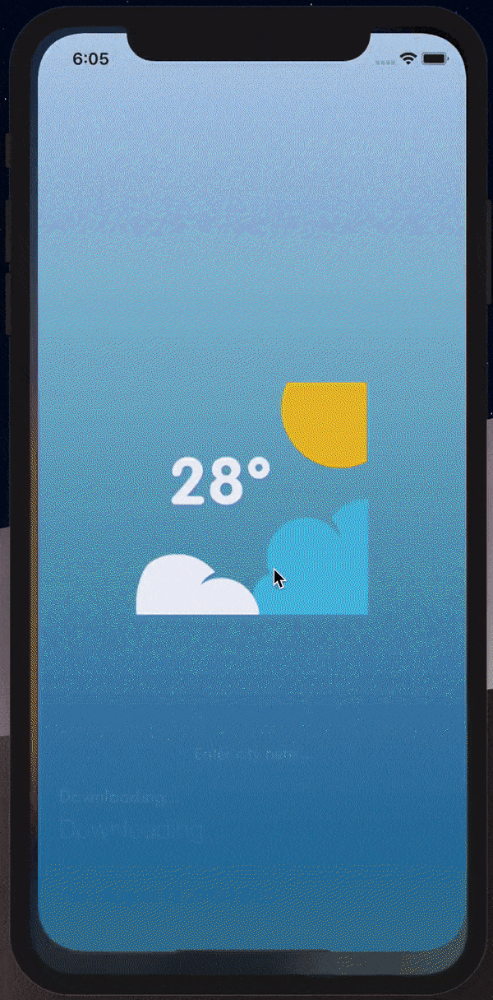
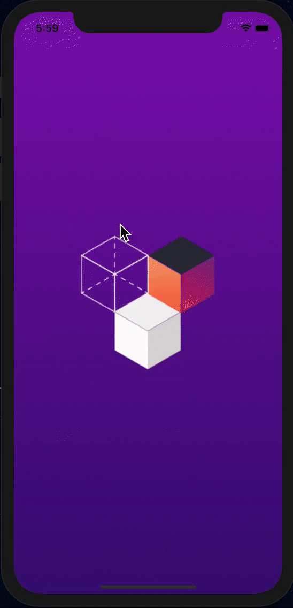
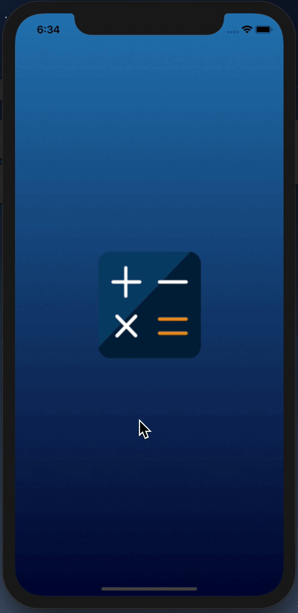
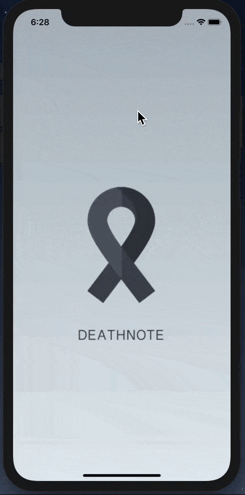
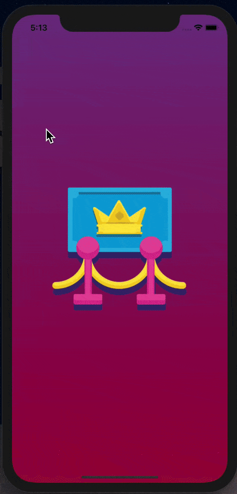

# iOS-Portfolio

### Proteins
`<projectLink>` : [Proteins](https://github.com/danilkozyr/proteins)

iOS application allowing create a scene of chemical ligand with information, atoms and their connections. The main features are: *TouchID or FaceID on logging into app or hiding the app to background process*, *SceneKit for creating a model* and *sharing models with friends*. Frameworks used: **Alamofire**, **SwiftyJSON**.

 

  

  

### Companion
`<projectLink>` : [Companion](https://github.com/danilkozyr/Companion)

iOS application based on [42API](https://api.intra.42.fr/apidoc) to search users in school system and display user's information. Frameworks used in the app: **Alamofire** and **SwiftyJSON**
 
 
 
 
  

### 42Plan
`<projectLink>` : [42Plan](https://github.com/danilkozyr/42Plan)

iOS map application based on Google SDK allowing us to draw a path between two places. Features are: *to geolocate my position*, *finding any place all over the world* and *drawing the path from one location to another*.
Frameworks used: **Google SDK** and **Alamofire**

 
 

  

### WeatherForecast
`<projectLink>` : [WeatherForecast](https://github.com/danilkozyr/Weather)

iOS Weather Forecast application allowing to show weather in the city we've entered. API used: **RecastAI** and **DarkSkyKit**

### MotionCube
`<projectLink>` : [MotionCube](https://github.com/danilkozyr/MotionCube)

iOS application allowing us to create random shape (circle or square) on touch, rotate, zoom and move every shape, all shapes are on the gravity and elasticity and all shapes can not go out the screen.
Instruments were used: **UIGestures** and **UIDynamicBehavior**

### Kanto
`<projectLink>` : [Kanto](https://github.com/danilkozyr/Kanto)

iOS tab bar application allowing to surf through iOS Map (MapKit) and getting info about pins on the map with the next features: *geolocation of my position*, *showing saved places*, *navigation through these places* and *three different map styles*. Instruments were used: **TabBarController**, **MKMapView**, **CLLocationManager**, **SegmentedControlBar** and **MKAnnotationView**

 
 
  
 
  

### MVC Calculator
`<projectLink>` : [Calculator](https://github.com/danilkozyr/Calculator)

iOS calculator application using MVC design pattern. Based on Stanford Lectures

 
 
  
 
  

### DeathNote
`<projectLink>` : [DeathNote](https://github.com/danilkozyr/DeathNote)

DeathNote is a manga in which Light Yagami is the owner of a notebook of death. The person whose name is written in this book dies inevitably. Features are: *DeathNote list with names, description and date*, *ability to add and delete DeathNotes*
Instruments were used: **Table View** and **Navigation Controller**

 
 
  
 
  

### Tweet
`<projectLink>` : [Tweet](https://github.com/danilkozyr/Tweet)

iOS application based on [Twiiter API](https://developer.twitter.com/en/docs/api-reference-index) allowing us to search tweets. 

### Gallery
`<projectLink>` : [PhotoGallery](https://github.com/danilkozyr/PhotoGallery)

iOS application with the following features: *gallery with images from NASA Website*, *every image in new view controller* and *image zoom*.
Instruments were used: **Collection View**, **Navigation Controller** and **URLSession for image downloading**

 
 
     
 
  
